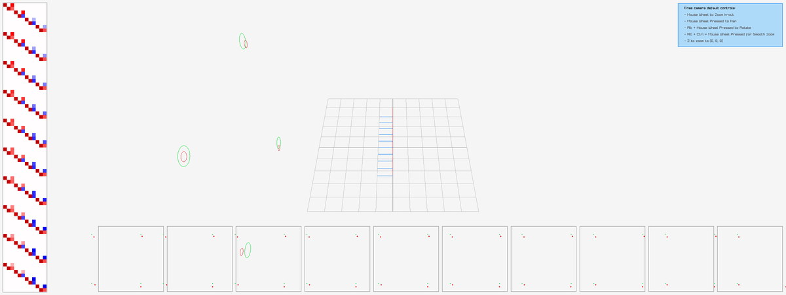

```
    ___       ___       ___       ___       ___       ___   
   /\  \     /\  \     /\__\     /\__\     /\  \     /\  \  
  /::\  \   /::\  \   /:/  /    /:/  /    /::\  \   /::\  \ 
 /::\:\__\ /::\:\__\ /:/__/    /:/__/    /::\:\__\ /::\:\__\
 \:\::/  / \/\::/  / \:\  \    \:\  \    \:\:\/  / \;:::/  /
  \::/  /    /:/  /   \:\__\    \:\__\    \:\/  /   |:\/__/ 
   \/__/     \/__/     \/__/     \/__/     \/__/     \|__|  
```

# Baller
Simple bundle adjustment visualization and manipulation tool. Requires:

* [RayLib](https://github.com/raysan5/raylib.git) (811e241f)
* [Ceres](https://github.com/ceres-solver/ceres-solver.git) (766f2ca)
* [Eigen](http://eigen.tuxfamily.org/index.php?title=Main_Page) (v.3.0)
* [Sophus](http://eigen.tuxfamily.org/index.php?title=Main_Page) (a0fe89a)

Generate a simple bundle-adjustment problem:

```
$ cd build
$ ./simple_scene --output simple.txt
$ ./render --input simple.txt --mode slam
```

Which should give:


Other modes are:

```
$ ./render --input simple.txt --mode localization
```


or:

```
$ ./render --input simple.txt --mode mapping
```



In all cases, the Jacobians are rendered on the left-hand side of the image, and
the reprojected points (per-camera) in the lower-right. Green is the
ground-truth, red is estimated.
